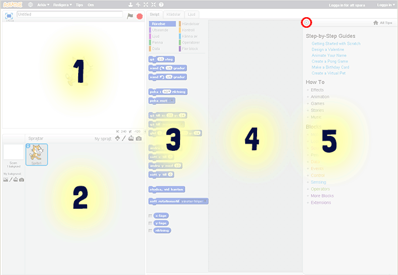
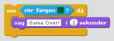
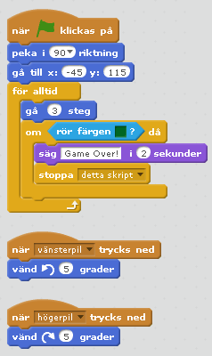
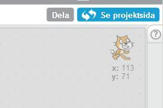

# Bug Race (intro)

## Bug Race (intro)

### Bug Rage (intro)

```solution
	# Testar detta

```
#Kodblock

```
när [w v] trycks ned
peka i (0) riktning
gå (5) steg
```


* Skapa ett **eget konto** på Scratch: [http://scratch.mit.edu/](http://scratch.mit.edu/)


Så här ser din arbetsyta i Scratch ut:



1. Här är din vita bakgrund som också kallas för **scen**.

2. Här kan du se vilka **sprajter** du använder.

3. I kolumnen i mitten plockar du ditt **skript**. Det är skript-block som finns i olika kategorier. Förutom skript finns flikar för **klädslar** och **ljud**.

4. Kolumnen till höger är din **skriptyta** – där du kodar genom att lägga dina skript.
Om du vill ta bort ett block drar du bara tillbaka blocket till mittkolumnen igen.

5. Här är en **Hjälp**-kolumn om du behöver, den kan du klicka bort uppe i det vänstra hörnet.**


## Delmoment 7: Känna av gräset

Nästa steg är att skapa ett skript som gör att skalbaggen känner av när den hamnar utanför din utmålade bana. Hur ska den kunna göra det? Det kan du lösa med ett skript som känner av vilken färg som skalbaggen rör sig över. Du behöver skapa ett VILLKOR för skalbaggen: OM skalbaggen rör vid färgen grön betyder det att den har åkt av banan, och DÅ ska spelet ta slut - Game Over!

13. Välj blocket "**om <> då**" som finns under **KONTROLL**. Det här blocket säger att OM det som står i **<>** händer, DÅ ska något annat hända. Om skalbaggen rör färgen grön, säg Game Over!

14. Under **KÄNNA AV **finns blocket "**Rör färgen <> ?"**. Dra den till **<>**, tryck på den lilla fyrkanten och sedan på ditt gräs. Den lilla fyrkanten får nu samma gröna färg som gräset.

  

15. Till sist skapar du ett skript för att spelet ska säga att spelet är över om skalbaggen nuddar den gröna färgen. Välj **"säg ___ i 2 sekunder"** under **UTSEENDE**, dra in det innanför "**om <**"**Rör färgen grön?> då**" och ändra texten till det du vill ska stå.

Testa ditt spel! Händer något när skalbaggen nuddar det gröna gräset? Om inte, vad tror du att det kan bero på?


## Delmoment 8: Göra klart skriptet

Något saknas! När vill du att datorn ska känna av om skalbaggen nuddar det gröna gräset? Det behöver göras efter varje steg skalbaggen tar, för att inte missa att den hamnar utanför banan. Därför måste du slå ihop skriptet som känner av gräset med skriptet som får skalbaggen att röra sig.

16. Lägg skriptet som känner av den gröna färgen, in i din "för alltid"-loop.

17. Lägg till **"stoppa detta skript"**, under **KONTROLL**, om skalbaggen springer av banan. På så sätt avslutas spelet och det går inte längre att styra skalbaggen.


## Ett färdigt spel!

Grattis, nu har du skapat ett spel! Det färdiga skriptet i sin helhet borde se ut så här:



Glöm inte att **spara ditt projekt**!
Döp det t ex till _"Bug Race"_ och ditt namn.

Tryck på DELA för att andra ska kunna hitta spelet på Scratch. Gå ut till projektsidan och låt någon annan **testa spelet!**


Saknas något? Hur skulle du vilja utveckla spelet?

Det får du göra i nästa uppgift!
