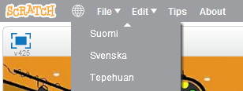

# h1

## h2

### h3

## h2{.noline}

---
```blocks
när [w v] trycks ned
peka i (0) riktning
gå (5) steg
```

```blocks
när ⚑ klickas på
```

```blocks
när ⚑ klickas på
gå (10) steg
```

```blocks
när ⚑ klickas på
för alltid
	gå (10) steg
```

```blocks
när ⚑ klickas på
gå till x: (-45) y:(115)
för alltid
	gå (10) steg
	
```

```blocks
när [vänsterpil v] trycks ned
vänd ↻ (15) grader
```

```blocks
när [vänsterpil v] trycks ned
vänd ↺ (15) grader
```


```blocks
när ⚑ klickas på
peka i (90 v) riktning
gå till x:(-45) y:(115)
för alltid
	gå (3) steg

```

```blocks
om <rör färgen [#4A7023]> då
	säg [Game Over] i (2) sekunder
```

```blocks
när ⚑ klickas på
peka i (90 v) riktning
gå till x:(-45) y:(115)
för alltid
	gå (3) steg
	om <rör färgen [#4A7023]> då
		säg [Game Over] i (2) sekunder
	stoppa [detta skript v]
```

```blocks
när [vänsterpil v] trycks ned
vänd ↻ (5) grader
```

```blocks
när [vänsterpil v] trycks ned
vänd ↺ (5) grader
```


answer{.answer}

<table class="noheader">
<tbody>
<tr>
<td style="width: 25%; vertical-align: middle;"><strong>Testa ditt projekt</strong></td>
<td>Följer Katten muspekaren? Ser det ut som att han går när han rör sig? Rör han sig i rätt hastighet?</td>
</tr>
</tbody>
</table>

<div class="solutiontoggle">
	<button class="icon arrow expand sibling minus">
		<span></span>
		<strong>Visa lösning</strong>
	</button>
	<div style="height: 54px;">
		<p>Testing 1 2 3</p>
	</div>
</div>


* Skapa ett **eget konto** på Scratch: [http://scratch.mit.edu/](http://scratch.mit.edu/)




